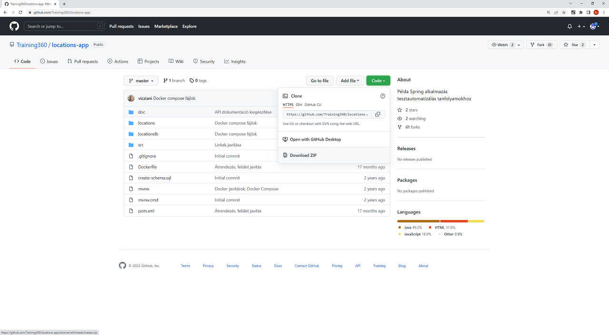
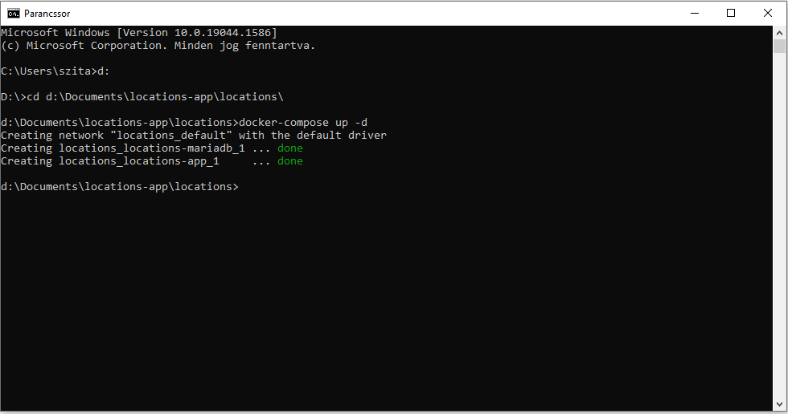
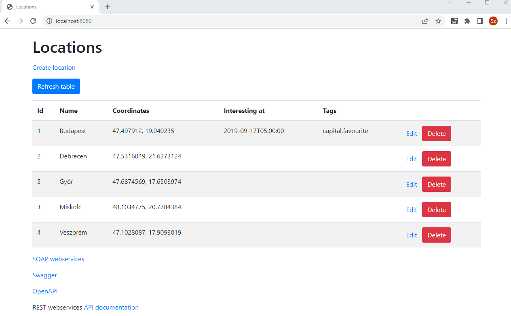

## SI0 Feladat: Setup

A feladatot az lesz, hogy a locations-app alkalmazásra felület automatizált teszteket készíts Selenium IDE segítségével. (A feladat végrehajtásához szükség van Docker-re a saját gépeden, így annak telepítését, esetleges beállításait előzetesen el kell végezned!) A locations-app alkalmazást az alábbi Github repository-ban találod:
`https://github.com/Training360/locations-app`

Az alkalmazás forrását az alábbi paranccsal tudod a saját gépedre lemásolni (leklónozni), ha a Git-et már telepítetted a gépedre. Nyiss egy *Parancssor*t (Command Prompt-ot), majd a parancsot a gépeden az általad kiválasztott mappában kell kiadni. 
> git clone `https://github.com/Training360/locations-app`

Ha esetleg még nincs a gépedre telepítve a Git, akkor az alkalmazás repójában a zöld Code gomb legördülő mezőjéből kiválasztva a zip-ként való letöltést tudod választani. A letöltött zip-et szintén az általad választott helyre tudod kicsomagolni a saját gépeden.


Akár a Github Desktop-ot is használhatod, a lényeg, hogy mentsd le az alkalmazást a saját gépedre.

Ha megvagy a lementéssel, akkor már csak el kell indítanod az alkalmazást. Ezt a következő módon tudod megtenni:
A lementett alkalmazás, locations-app mappájában található locations almappájába navigálj el a már megnyitott vagy időközben megnyitott *Parancssor*ban. Az alábbi paranccsal tudod elindítani a környezetet (docker-compose.yml).
```
docker-compose up -d
```

Az alkalmazás hamarosan elindul, s ezt követően a *Parancssor*ban az alábbi kép fogad.


Webböngészőben nyisd meg az alábbi URL-t:
`http://localhost:8080`




Ezzel készen is vagy a feladatok elvégzésére szánt környezet beállításával.
