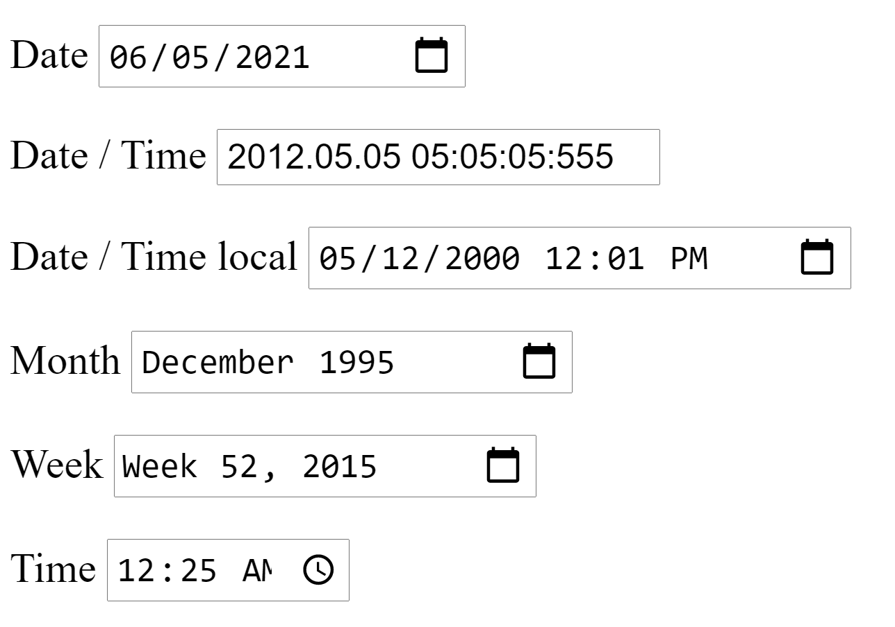

## S24 Feladat: Selenium dátum mezők

A feladatot külön python fájlban oldd meg! A feladat tartalmazza az elvárt fájlnevet! Csak ezen a néven fogadható el a megoldás.

Készíts egy Python alkalmazást, ami selenium-ot használ! Töltsd be a `http://selenium.oktwebs.training360.com/forms.html` oldalt! Koncentrálj a dátum mezőkre!

A célod, hogy az **alábbi képen látható** dátum és idő értékeket **pontosan** beállítsd az alkalmazásba, selenium segítségével.

> A megoldást egy `S24_setdates.py` nevű fájlban kell beadnod!

### Feladat beadása
A fent említett python fájlt és benne a megoldásodat a `hf-tesztelo-strk2-halado` szervezet alá létrehozott `vezeteknev_keresztnev_hf` privát github repodban egy `selenium2_hf` nevű mappába helyezd el!
